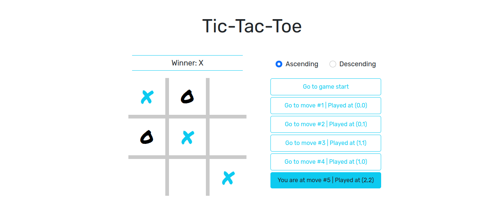

# Jogo da velha

Este projeto apresenta um jogo da velha construído a partir do tutorial oficial do site do *React*. A aplicação além de apresentar o vencedor ao término do jogo, também armazena o histórico de jogadas, permitindo que este seja revisado e alterado posteriormente. Também foram desenvolvidas as melhorias propostas, como estilizações e escolha da forma de ordenação do histórico.

## :gear: Tecnologias

- HTML
- CSS
- JavaScript
- React
- Bootstrap

## :gear: Layout

